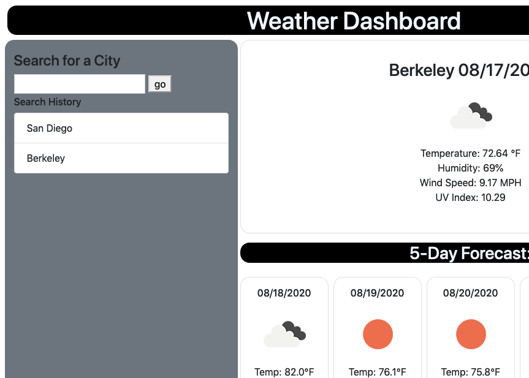

# Weather Dashboard
> This website displays current weather information and forecasted weather information for the city specified by the user. The website saves the user's most recent searches in search history for easy access. Built using OpenWeatherMaps API.

## Release History

* 0.0.1
    * Wrote HTML & Javascript
* 0.1.1
    * Implemented search history saving to local storage.
* 0.2
    * Added styling with bootstrap and own css.

## Meta
Repository [here](https://github.com/moonstripe11/hw6-weatherDashboard).

Live Demo [here](https://moonstripe11.github.io/hw6-weatherDashboard).

Kojin Glick – [@kojinglick](https://twitter.com/kojinglick) – kojinglick@gmail.com
